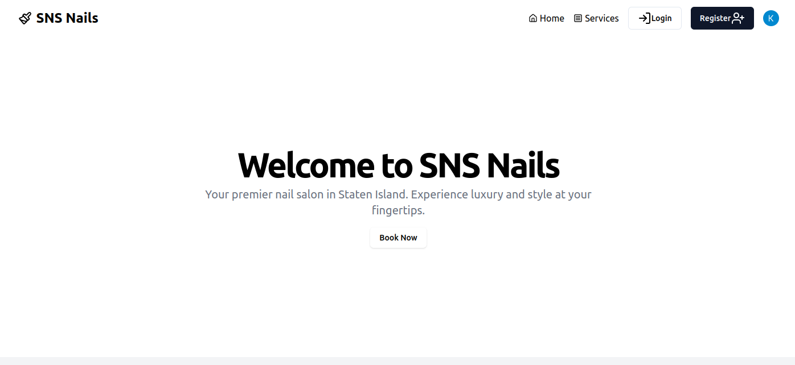
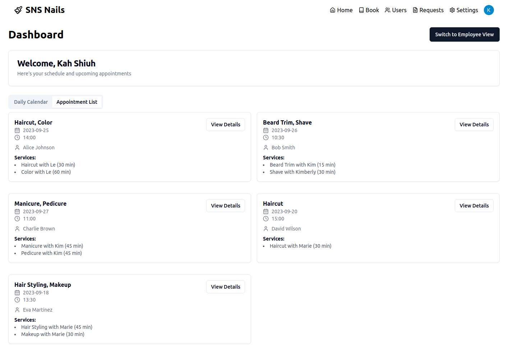
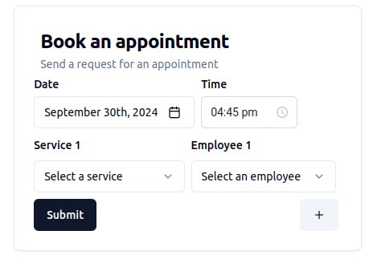
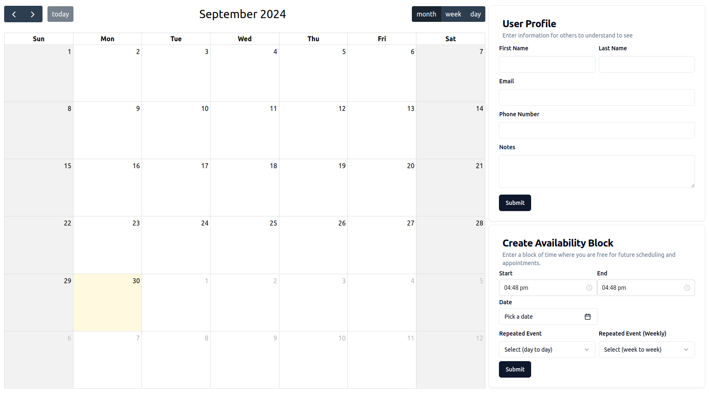
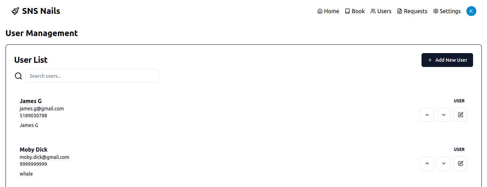

# Salon

ERM for Nail Salons

### Dependencies

1. Golang 1.20+
2. pnpm
3. React
4. Maven, Java 22

### To Run

1. Frontend

```bash
cd salon-frontend

pnpm install

pnpm run
```

2. Backend

```bash
cd salon-backend

./scripts/install-services.sh

make all
```

### To Do

1. Write notes about customers

2. Automatic send reminders to customers

3. Create a waitlist where customers can see availabilty

4. Keep payment method on file... Apple Pay?

5. List forms of communication

6. List which people do what services


### Images

##### Landing Page

For users that are not logged in, this page allows users to search services and check out the nail salon.



##### Home Page

This is the main dashboard that all users will hit when they have logged in. It gives a card and calendar view of what appointmetns have occurred and what is going to occur.



##### Booking Page

This is a simple form to allow users to add as many services they want and who they want to carry out said services.



##### Settings Page

Users are allowed to set their schedule, update information and availabilities to improve the back-and-form process of scheduling appointments.



##### Users Page

Here, administrators can search through users, see their preferences and their history.

