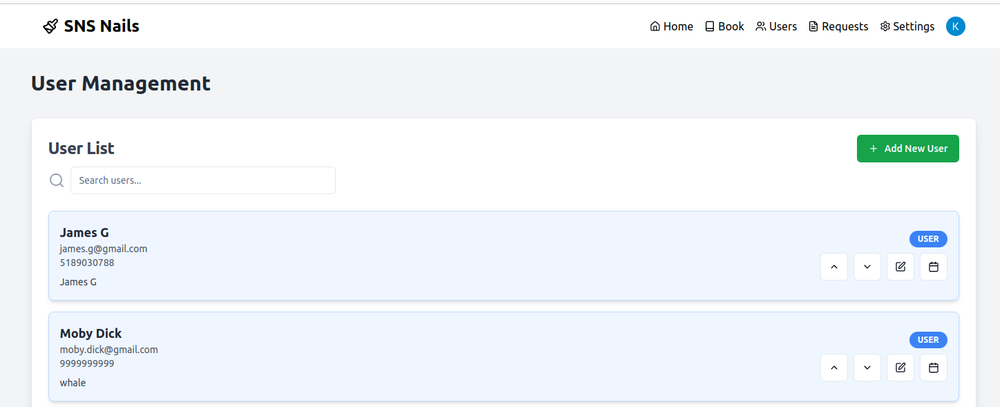

# Salon

Customer Management System for Nail Salons, Specifically SNS nails in SI, NYC

### Main Objectives

1. Write notes about customers

2. Automatic send reminders to customers

3. Create a waitlist where customers can see availability

4. Keep payment method on file... Apple Pay?

5. List forms of communication

6. List which people do what services


### Images

##### Landing Page

This page allows users who are not logged in to search for services and check out the nail salon. Clicking on services allows users to see what services and goods are sold at this salon. Admins are allowed to edit the prices and times of goods and services; they can also create and delete these items.


##### Home Page

This is the main dashboard that all users will hit when they have logged in. It gives a card and calendar view of what appointments have occurred and what is going to occur.


##### Booking Page

This is a simple form to allow users to add as many services as they want and who they want to carry out said services. It can scale to include as many services as needed.


##### Settings Page

Users are allowed to set their schedule, and update information and availabilities to improve the back-and-form process of scheduling appointments.


##### Users Page

Here, administrators can search through users, and see their preferences and their history. There are different colors for different roles of people: Users can also be promoted/demoted on this page. Most importantly, it allows for admins to see the availability of their customers.



##### Appointments Page

Here, employees can change and verify appointments so see what status each appointment is on. An employee can filter by things such as name and date. A user can also view their appointments here, but it is mainly to see if any of their requests for an appointment have been confirmed.


### Dependencies

1. Golang 1.20+
2. pnpm
3. ReactJS
4. Maven, Java 22

### To Run

1. Frontend

```bash
cd salon-frontend

pnpm install

pnpm run
```

2. Backend

```bash
cd salon-backend

./scripts/install-services.sh

make all
```